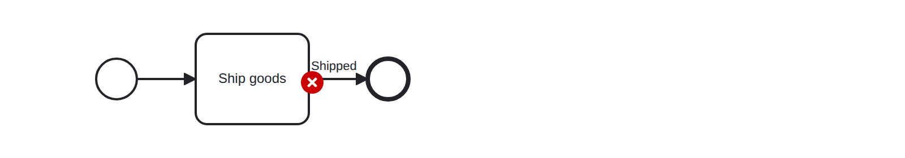
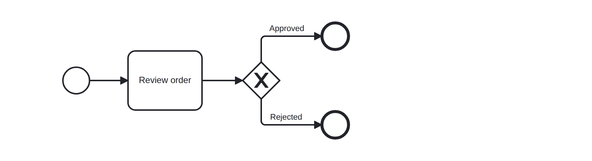

# Superfluous Label (superfluous-label)

Checks that unconditional sequence flows do not have a label. Labels are only meaningful on sequence flows forking out of XOR/OR gateways, on conditional flows, and on default flows. Anywhere else they duplicate information already conveyed by the diagram.


Example of __incorrect__ usage for this rule:



```xml
    ...
    <bpmn:sequenceFlow name="Shipped" sourceRef="Task" targetRef="EndEvent" />
    ...
```

Cf. [`superfluous-label-incorrect.bpmn`](./examples/superfluous-label-incorrect.bpmn).


Example of __correct__ usage for this rule:



```xml
    ...
    <bpmn:sequenceFlow name="Approved" sourceRef="Gateway" targetRef="EndEvent_Approved">
      <bpmn:conditionExpression xsi:type="bpmn:tFormalExpression">${approved}</bpmn:conditionExpression>
    </bpmn:sequenceFlow>
    ...
```

Cf. [`superfluous-label-correct.bpmn`](./examples/superfluous-label-correct.bpmn).
